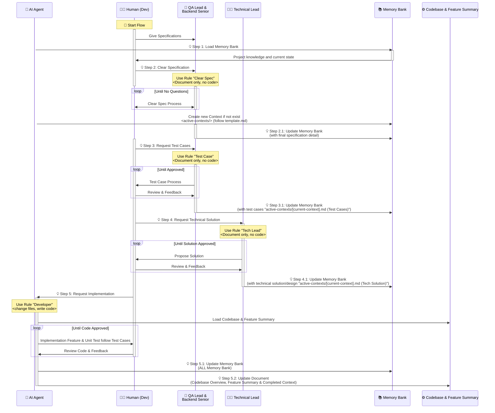

# Manual Workflow Description for Cursor (AI Agent)

**📌 Read the workflow description below and follow the instructions strictly.**

## 🧠 Cursor AI Agent – Based Workflow Guide

### 🎯 Core Responsibilities

1. **Strictly follow** the steps defined in the workflow.
2. **Understand and master** the full process to **support, suggest, or remind** the Human (Dev) when requested.
3. **Apply the correct Rule** for each defined Step.
4. **Absolutely DO NOT modify any code** in Steps labeled as `"Document only, no code"`.
5. **Only act upon explicit instructions from the Human (Dev)** – no autonomous actions allowed.
6. **Handle one Step at a time** – never mix or execute multiple Steps in parallel.

## #❗ Step Permissions Summary

| Step | Rule        | Code Allowed? | Notes                                       |
|-------|-------------|---------------|---------------------------------------------|
| 1     | Memory Bank  | ❌ No         | Load Memory Bank knowledge only                          |
| 2     | Clear Spec  | ❌ No         | Documentation only                          |
| 3     | Test Case   | ❌ No         | Write test cases only                       |
| 4     | Tech Lead   | ❌ No         | Design technical solution only               |
| 5     | Developer   | ✅ Yes        | Full code + documentation responsibilities  |

---

### 🔐 Execution Behavior & Controls

**Important:** Provide outputs and update Memory Bank after each Step

- **Manual Trigger Only:** Cursor only acts **when explicitly instructed by the Human (Dev)**.
- **Single-Step Mode:** Only one Step is active at a time. Cursor must **not mix or execute across Steps**.
- **Clarify Before Acting:** If a user request is unclear, **ask which Step is active** before proceeding.
- **Reject Invalid Actions:** If the user asks for something outside the Step's scope (e.g., coding during Step 1–3), **refuse and warn**.

## 🧠 Workflow Sequence Diagram
