# Developer and Technical Lead Guide

## Core Principles

The main objectives of this guide are:
1. Ensure developers follow a strict process that generates sufficient documentation for future AI Agent autonomy
2. Enable Technical Leads to enforce process compliance
3. Maintain high-quality documentation in Memory Bank for AI context preservation

## Developer Implementation Flow

### Process Requirements

Developers MUST follow this process to ensure:
- Cursor AI fully understands the context and generates highest quality code
- Documentation and Memory Bank are consistently updated after each completed task

### Implementation Steps

```mermaid
sequenceDiagram
    participant Dev as Developer
    participant Cursor

    Note over Dev: 🚀 Start Flow

    %% Memory Bank and Initial Requirement Phase
    Dev->>Cursor: Ask "Follow Memory Bank"

    Cursor-->>Cursor: Load Memory Bank

    Dev->>Cursor: Ask "Follow @0-work-flow-manual.md, new requirement: xxx"

    Cursor->>Cursor: Analyze & give Questions
    Dev->>Cursor: Read & Answer Questions
    Dev->>Cursor: Ask "Update Document with Final Requirement"

    %% Test Case Phase
    Dev->>Cursor: Ask "Write Test Cases"

    Cursor-->>Cursor: Write Test Cases
    Dev->>Cursor: Ask "Update Document with Test Cases"

    %% Technical Solution Phase
    Dev->>Cursor: Ask "Give Technical Solution"

    Cursor-->>Cursor: Create Technical Solution
    Dev->>Cursor: Review & Feedback Solution

    Dev->>Cursor: Ask "Update Document with Technical Solution"

    %% Implementation Phase
    Dev->>Cursor: Ask "Start Implementation"
    Cursor-->>Cursor: Write Code
    Dev->>Cursor: Review Code & Feedback
    Dev->>Cursor: Say "Approved Code and write Unit Test follow previous Test Cases"
    Cursor-->>Cursor: Write Unit Test
    Dev->>Cursor: Request special Test Cases if needed

    %% Finalization Phase
    Dev->>Cursor: Ask "Update Memory Bank"
    Dev->>Cursor: Say "Completed Task"
```

## Technical Lead Review Process

### Primary Responsibilities

Technical Leads MUST:
1. Ensure developers strictly follow the implementation process
2. Verify complete documentation for each Pull Request
3. Validate Memory Bank updates reflect code changes
4. Reject PRs with insufficient documentation

### Review Flow

```mermaid
sequenceDiagram
    participant Cursor
    participant Dev as Developer
    participant TL as Tech Lead

    Note over Dev: 🚀 Start Flow

    Dev->>Cursor: Follow Implementation Flow
    Dev->>Dev: Review Document / Memory Bank changes
    Dev->>TL: Pull Request

    loop Review Document and Code
      TL->>TL: Memory Bank / Document updated?
      TL->>TL: Evaluate Solution / Code
      TL->>Dev: Feedback
      Dev->>TL: Update
    end

    TL->>Dev: Approval
```

### Documentation Review Checklist

Technical Leads must verify:
1. Memory Bank is updated with:
   - New business logic
   - Technical decisions
   - Architecture changes
   - New Code changes
   - Codebase and Feature Summary changes

2. Implementation Process has:
   - Complete requirements documentation
   - Comprehensive test cases
   - Detailed technical solution
   - Updated unit tests

3. Code Changes align with:
   - Documented requirements
   - Approved technical solution
   - Test coverage requirements

### Enforcement Policy

1. PRs missing documentation MUST be rejected
2. Documentation quality is as important as code quality
3. All technical decisions must be documented for AI context
4. No exceptions to documentation requirements are allowed
