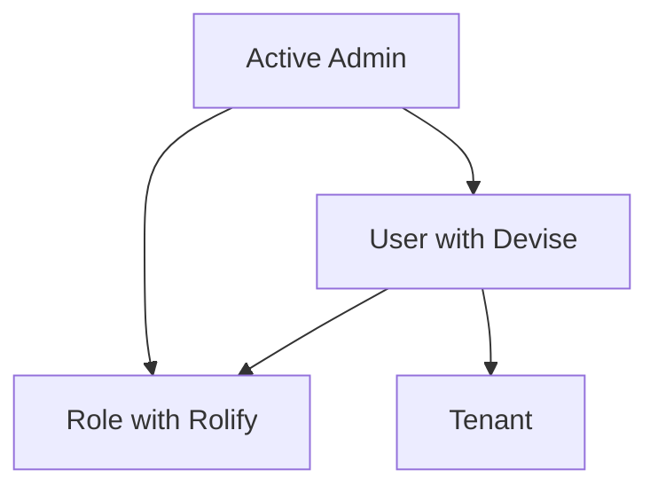

# Feature Summary

## 1.1 Frontend Applications

### API Login
#### What Is This?
- N/A
#### How To Use?
- N/A
#### Solution / Architecture Design
  - [Mermaid chart]

### API Forgot Password
#### What Is This?
- N/A
#### How To Use?
- N/A
#### Solution / Architecture Design
  - [Mermaid chart]

## 1.2 Reminders

## 1.3 User Management

### User Authentication with Devise
#### What Is This?
- User model with Devise for authentication
- Role management with Rolify (client role)
- Integration with multi-tenant architecture
#### How To Use?
- Users can register, login, recover password
- Admin can manage users through Active Admin
- Users are associated with specific tenants
- Users are assigned the client role
#### Solution / Architecture Design

