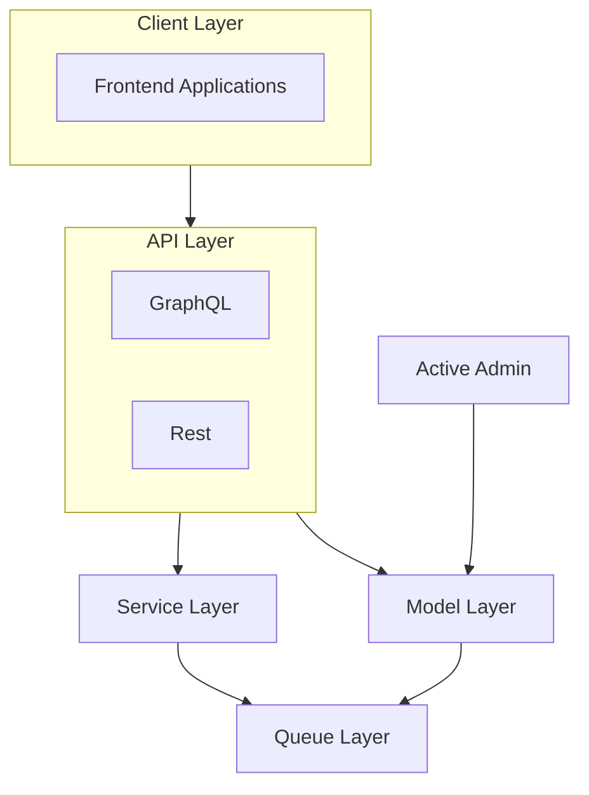
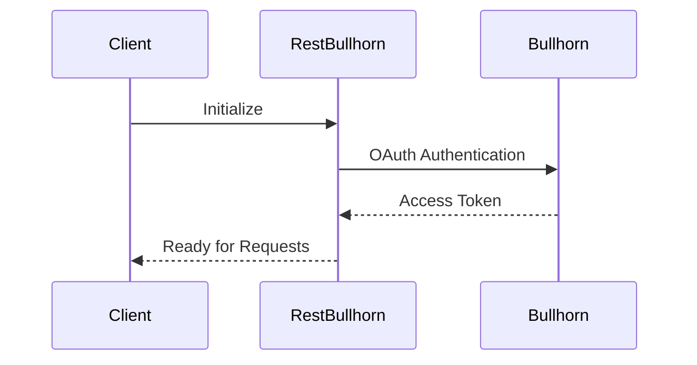
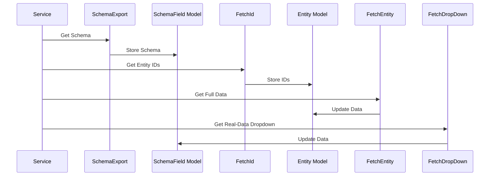
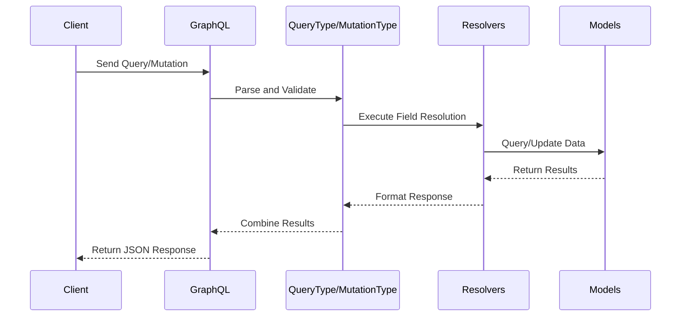

# System Patterns

## Architecture Overview

### Layers

### Data Flows

#### 1. Authentication Flow

#### 2. Data Synchronization Flow

#### 3. GraphQL API Flow

#### 4. Models
  - Follow @db/schema.rb

## Key Design Patterns

### 2. Multi-tenant Pattern
- Tenant-specific configurations
- Isolated data per tenant
- Shared infrastructure

### 3. Queue-based Processing
- Asynchronous job processing with Sidekiq
- Batch processing capabilities
- Retry mechanisms for failed jobs

## Security Patterns
1. **Credential Management**
   - Encrypted storage
   - Secure token handling
   - Regular token rotation

2. **Data Protection**
   - PII encryption
   - Secure data transmission
   - Access control per tenant

3. **API Security**
   - GraphQL query depth and complexity limits
   - Rate limiting for GraphQL endpoint
   - Input validation and sanitization

## Performance Patterns
1. **Caching Strategy**
   - Redis for schema caching
   - Efficient data retrieval

2. **Batch Processing**
   - Optimized bulk operations
   - Controlled parallel processing

3. **Rate Limiting**
   - API request throttling
   - Queue-based workload management