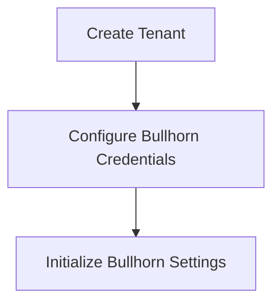

# Technical Context

## Technology Stack

### Core Technologies
- Ruby on Rails
- PostgreSQL
- Redis
- Sidekiq
- Active Admin
- GraphQL

### Development Tools
- Git
- RSpec
- Rubocop
- Ruby LSP
- GraphiQL (GraphQL IDE)

### External Systems
- **Bullhorn Integration:**
  - Bullhorn REST API
  - OAuth 2.0 Authentication

## Development Setup

### Prerequisites
- Ruby (see .ruby-version)
- PostgreSQL 14
- Redis 7

### Project Structure
```
app/
├── admin/         # Active Admin interfaces
├── models/        # Data models
├── jobs/          # Sidekiq jobs
├── services/      # Business logic services
├── controllers/   # Request handlers
├── views/         # Admin UI templates
└── graphql/       # GraphQL API components
    ├── types/     # GraphQL type definitions
    ├── mutations/ # GraphQL mutations
    ├── resolvers/ # Logic for resolving GraphQL fields
    ├── schema.rb  # Main GraphQL schema
    ├── query_type.rb    # Root Query type
    └── mutation_type.rb # Root Mutation type

config/            # Rails configuration
db/                # Database migrations
lib/               # Extended libraries
spec/              # Test files /rspec
```

### Environment Configuration
- `.env` for local development
- `.env.sample` for reference, when add new one to .env, it should also be added here

### Docker Setup
- `docker-compose.yml` for production
- `Dockerfile` for container definition

## Dependencies

### Ruby Gems
Key dependencies from Gemfile:
- Rails for web framework
- Sidekiq for background processing
- Active Admin for admin interface
- GraphQL for API layer
- RSpec for testing
- Rubocop for linting

### Development Dependencies
- Ruby LSP for IDE support
- Development specific gems
- Testing frameworks

## Technical Constraints

### Database
- PostgreSQL for primary storage
- Multi-tenant data isolation

### API Integration
- REST API communication
- Token-based authentication
- Rate limiting considerations

### API For Frontend
- GraphQL API for flexible, client-driven data fetching
- GraphiQL for API exploration and testing in development
- Structured types system with query_type.rb and mutation_type.rb as entry points

### Performance
- Background job processing
- Batch operations
- Caching strategies

## Tool Usage Patterns

### Git Workflow
1. Feature branch from master with format "feature/[JIRA-CODE]-[feature-name]"
2. Code review process
3. CI/CD pipeline integration

### Testing Strategy
1. Unit tests with RSpec
2. Automated testing in CI

### Code Quality
1. Rubocop for style checking
2. Code review guidelines
3. Documentation requirements

## Security Considerations

### Authentication
- Admin user authentication
- API authentication
- Token management

### Data Protection
- Sensitive data encryption
- Tenant data isolation
- Access control

### API Security
- Rate limiting
- Request validation
- Error handling

### Tools
- Use Brakeman for security scanning (CI)

## Monitoring and Logging

### Application Monitoring
- Error tracking
- Performance monitoring
- Resource usage

### Job Monitoring
- Sidekiq dashboard
- Job status tracking
- Failure handling

### Logging
- Application logs
- Background job logs
- Error logs

### Database
- PostgreSQL for primary storage
- ID and foreign key used as UUID

### Flow/Chart
- Use Mermaid for chart, Example:

